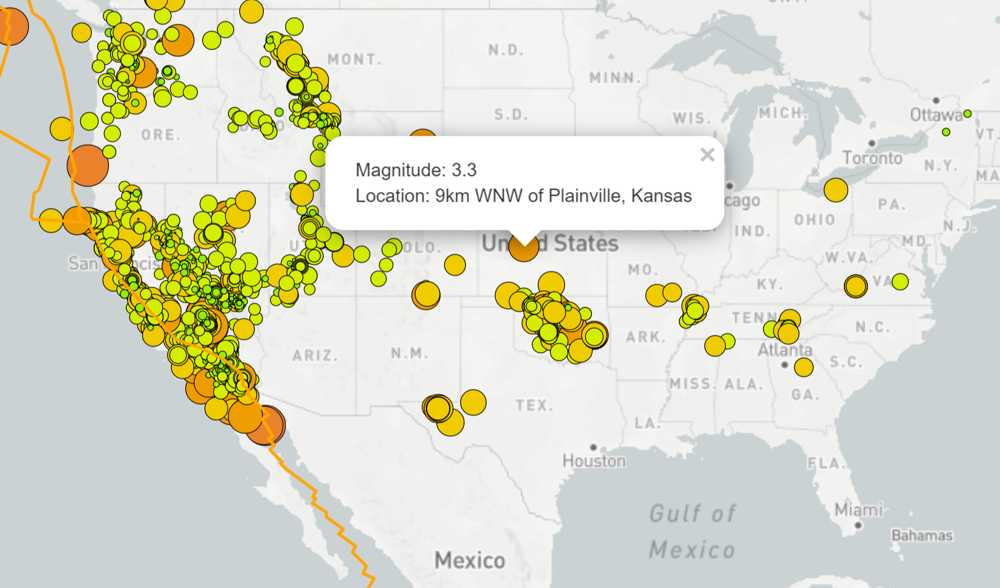
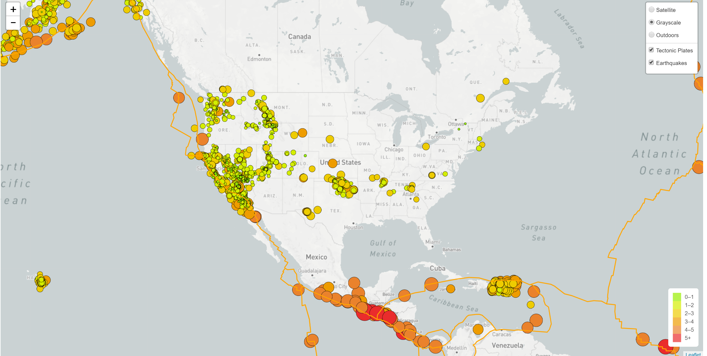
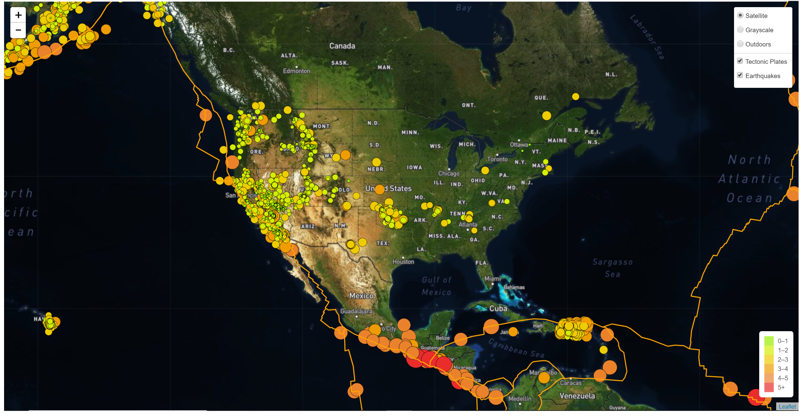
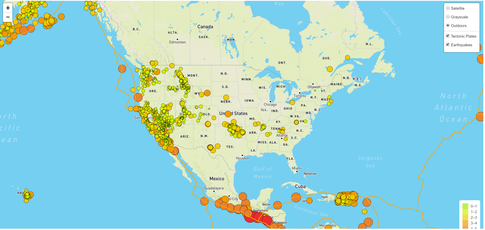

# Mapping with Leaflet
## USGS
### live [demo](https://indirapv.github.io/Interactive-Realtime-Maps/)

Welcome to the United States Geological Survey, or USGS for short! 

For this challenge:
* Analyzed two datasets.

 	* Earthquake data from USGS live [feed](http://earthquake.usgs.gov/earthquakes/feed/v1.0/geojson.php).

 	* Tectonic plates data from [https://github.com/fraxen/tectonicplates](https://github.com/fraxen/tectonicplates).

* Created a map using Leaflet.js that plots all of the earthquakes from data set based on their longitude and latitude.

* Data markers reflects the magnitude of the earthquake in their size and color. Earthquakes with higher magnitudes should appear larger and darker in color.

* Included popups that provide additional information about the earthquake when a marker is clicked.

* Create a legend that will provide context for your map data.
  
* Plot second data set on the map to illustrate the relationship between tectonic plates and seismic activity. 

* Added a number of base maps to choose from as well as separate out two different data sets into overlays that can be turned on and off independently.

* Added layer controls to map.

### Copyright

Indira V. Poovambur © 2019.
